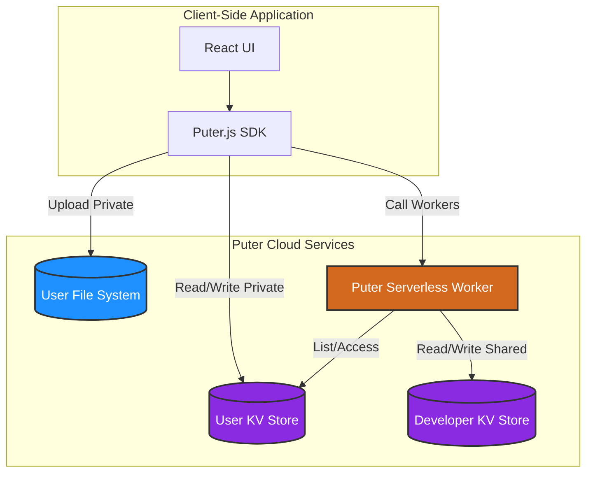
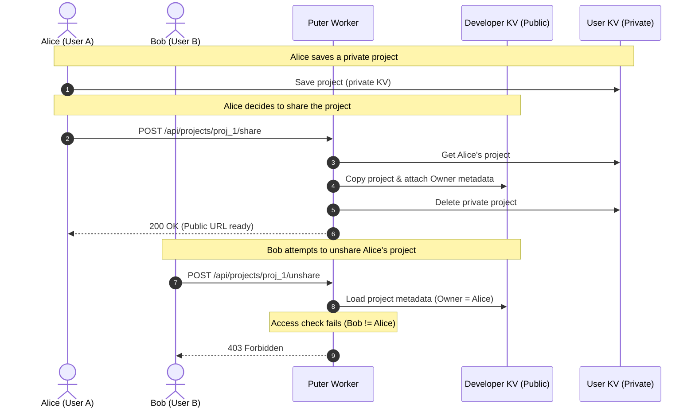

# 4Wall — AI Architectural Visualization

4Wall is an AI-first architectural visualization application that enables users to upload 2D floor plans, generate photorealistic 3D interior renders using AI, and securely share or save their projects. The app is built with **React Router 8**, **TypeScript**, **Tailwind CSS**, and is powered by the **Puter.js SDK** for cloud features (authentication, key-value storage, file storage, static web hosting, serverless workers, and AI).

---

## 🏗 System Architecture

4Wall relies on Puter's decentralized cloud services to act as its database, file hosting, serverless backend, and hosting layer.



### 1. KV (Structured Data)
Stores project metadata, user preferences, render references, and sharing status.
*   **Private Namespace**: Resides in the caller's private user KV store. Keys are structured as `user:${userId}:project:${projectId}`.
*   **Public Namespace**: Resides in the developer's centralized KV store (`me.puter.kv`). Keys are structured as `project:${projectId}`.

### 2. FS + Hosting (Image Storage & Delivery)
Stores uploaded floor plans and AI-generated renders.
*   Uses **Puter File System (`puter.fs`)** to write files to the user's personal cloud directory (`projects/${projectId}/`).
*   Uses **Puter Hosting (`puter.hosting`)** to dynamically turn the project directory into a live static site, exposing optimized, public URLs (e.g., `https://[subdomain].puter.site/[path]`) to share images across the web.

### 3. Serverless Workers (Secure Backend)
Handles routing, access control, and atomic sharing/unsharing logic.
*   Ensures users can write/read their own projects locally but must route through the worker for cross-user operations.
*   Implements route handlers under `POST /api/projects/:projectId/share` and `POST /api/projects/:projectId/unshare`.

---

## 🔒 Security & Access Control Model

To maintain strict security while avoiding backend infrastructure overhead, 4Wall uses a hybrid authentication model:



### Authorization Boundaries
1.  **Client-Side Operations**: The client-side application runs under the *User's Identity*. Users can read/write directly to their own private `user.puter.kv` and `user.puter.fs`, but have **no direct write/delete access** to other users' directories or the developer's centralized global database.
2.  **Worker Operations**: The Puter serverless worker runs under the *Developer's Identity*. This gives it permission to act as an intermediary—reading from the user's private namespace (when authenticated) and writing/deleting in the public namespace (`me.puter.kv`).
3.  **Ownership Verification**: When sharing or unsharing, the worker extracts the authenticated user's ID using `user.id` and validates it against the project's metadata before performing any modifications, protecting users from unauthorized access (returning `403 Forbidden` if ownership doesn't match).

---

## ⚙️ Core Technology Stack

*   **Frontend Framework**: [React Router 8](https://reactrouter.com/) (using the new Vite compiler environment with Client/SSR builds)
*   **Styling**: Vanilla CSS with Tailwind CSS v4 compiler optimization
*   **Cloud Platform SDK**: [@heyputer/puter.js](https://github.com/HeyPuter/puter.js)
*   **Icons**: [Lucide React](https://lucide.dev/)

---

## 🚀 Getting Started

### 1. Installation
Clone the repository and install dependencies:
```bash
npm install
```

### 2. Environment Configuration
Copy `.env.example` to `.env.local`:
```bash
cp .env.example .env.local
```
Set `VITE_PUTER_WORKER_URL` to your deployed Puter Worker URL. If left empty, the application will automatically fall back to browser-level `localStorage` for offline development.

### 3. Running the App
Start the local development server:
```bash
npm run dev
```
Open `http://localhost:5173` to test the application.

---

## 🛠 Puter Worker Deployment

To deploy or update the serverless backend worker:

1.  Install the Puter CLI globally:
    ```bash
    npm install -g @heyputer/cli
    ```
2.  Log in to your Puter account:
    ```bash
    puter login
    ```
3.  Deploy the worker:
    ```bash
    puter worker deploy lib/puter.worker.js [your-worker-name]
    ```
4.  Copy the output worker URL (e.g., `https://[your-worker-name].puter.work`) and set it as `VITE_PUTER_WORKER_URL` in your `.env.local` file.
